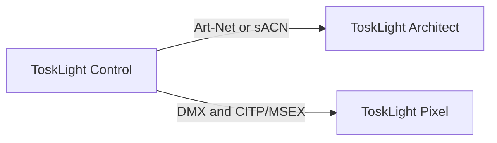

# Markdown Manual Renderer

`@tosklight/markdown-manual-renderer` turns a numbered folder of CommonMark, GFM, and
Obsidian-flavored Markdown into two outputs from one parsed document model:

- a searchable, responsive, self-contained offline HTML manual and deterministic ZIP; and
- a paginated PDF produced with React-PDF, including metadata, bookmarks, internal links,
  running headers, footers, and page numbers.

It supports headings, paragraphs, emphasis, code, links, local images, tables, nested lists,
task lists, blockquotes, Obsidian callouts, `[[wikilinks]]`, environment placeholders, and
build-time Mermaid diagrams. Raw Markdown HTML is not executed.

## CLI

```sh
npx --package @tosklight/markdown-manual-renderer markdown-manual build \
  --source docs/help \
  --config docs/help/manual.json \
  --html-dir .artifacts/manual/html \
  --html-archive .artifacts/manual/manual-html.zip \
  --pdf .artifacts/manual/manual.pdf
```

The three output flags are optional overrides. Paths in the JSON config are resolved relative to
the config file; CLI paths are resolved relative to the current working directory.

## Configuration

```json
{
  "title": "ToskLight Operator Manual",
  "subtitle": "Control, Architect, and Pixel",
  "author": "ToskLight contributors",
  "language": "en",
  "version": "${LIGHT_MANUAL_VERSION}",
  "description": "ToskLight operator documentation",
  "brand": { "logo": "../../assets/brand/icon.png" },
  "chapterIndexNames": ["index.md", "index.markdown"],
  "output": {
    "htmlDir": "../../.artifacts/generated/manual/html/tosklight-manual",
    "htmlArchive": "../../.artifacts/generated/manual/html/tosklight-manual-html.zip",
    "pdf": "../../.artifacts/generated/manual/pdf/tosklight-manual.pdf"
  },
  "theme": {
    "accent": "#0f8f82",
    "navigationBackground": "#071621",
    "calloutDanger": "#b42318",
    "callouts": { "warning": "#b7791f", "tip": "#16803c" }
  },
  "pdf": {
    "pageSize": "A4",
    "contentsDepth": 3,
    "header": "{title} - {chapter}",
    "footer": "ToskLight Operator Manual",
    "margins": { "top": 54, "right": 50, "bottom": 54, "left": 50 }
  },
  "mermaid": {
    "theme": "base",
    "backgroundColor": "transparent",
    "width": 1400,
    "height": 900,
    "scale": 2,
    "themeVariables": {
      "primaryColor": "#d7f3ef",
      "primaryBorderColor": "#0f8f82",
      "lineColor": "#425466",
      "edgeLabelBackground": "#ffffff"
    }
  },
  "inlineTokens": [
    { "pattern": "\\[([A-Z0-9.]+)\\]", "kind": "desk-key", "labelGroup": 1 }
  ],
  "hookModules": ["manual-hooks.mjs"],
  "layout": {
    "columns": 1,
    "columnGap": 18,
    "hierarchyHeadings": true,
    "maxHeadingDepth": 6,
    "justifyText": true
  }
}
```

`${NAME}` placeholders in both the JSON configuration and Markdown sources are read from the
environment. An unset variable fails the build, so a release cannot silently contain an empty
version. Write `\${NAME}` when the literal placeholder syntax should be printed. Inline-token
patterns are JavaScript regular-expression sources and must not match an empty string.

`layout.columns` accepts `1` or `2`. In two-column mode, major headings, tables, figures, code,
and callouts span both columns. With `hierarchyHeadings` enabled, a folder index keeps the folder's
heading level, an ordinary file is one level deeper, and nested folders deepen the hierarchy even
when they have no index. `maxHeadingDepth` caps the effective level.

## Render hooks

Hook modules are resolved relative to the configuration file. They export one hook, an array of
hooks, or a default export. A hook can replace any normalized Markdown node before both HTML and
PDF rendering:

```js
export default {
  name: "control-keys",
  transform(node, context) {
    if (node.type !== "inlineToken" || node.data?.kind !== "desk-key") return;
    return {
      ...node,
      data: {
        ...node.data,
        presentation: {
          component: "key-sequence",
          keys: [{ label: node.value, variant: node.value === "REC" ? "record" : "regular" }],
        },
      },
    };
  },
};
```

The built-in `key-sequence` presentation supports `regular`, `record`, `clear`, `preload`,
`keyboard`, and `shift` variants. A key with `icon: "shift"` receives the Shift symbol. Table hooks
may set `data.columnWidths` to relative weights; PDF-oriented hooks may additionally set
`data.rowsPerPage` and `data.rowWeight` for unusually dense or verbose tables.

## Mermaid diagrams

Use an ordinary fenced Mermaid block:

````md

````

The build uses Mermaid's official renderer once and embeds its scalable SVG in HTML and a
high-resolution PNG in the React-PDF document. Invalid diagrams fail with the diagram number and
Mermaid's parsing error. The `mermaid` configuration controls the Mermaid theme, theme variables,
background, viewport, and scale. Puppeteer supplies the isolated build-time browser; the generated
HTML does not need Mermaid JavaScript or a network connection.

## Obsidian syntax

```md
> [!danger] Graphic missing
> Add the missing workflow diagram here.

See [[Patching|the patching chapter]].
```

Callout types are case-insensitive. `[!note]+` and `[!note]-` fold markers are retained in the
shared model; static HTML and PDF intentionally render their content expanded. A wikilink resolves
by unique page title, basename, or root-relative Markdown path. `![[image.png|Caption]]` embeds a
local image.

## Development

```sh
npm install
npm run typecheck
npm test
npm run build
```

The package targets Node.js 22 or newer. It does not fetch remote images, execute raw Markdown
HTML, or allow local Markdown assets to escape the supplied source root.
