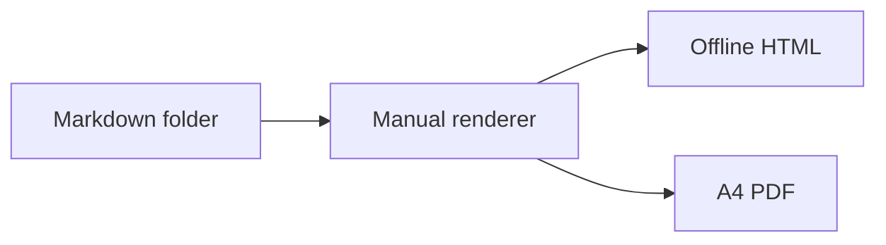

# Example Manual

This small manual demonstrates the portable renderer configuration. Its version is
`${EXAMPLE_VERSION}`.

> [!note] One source tree
> The same normalized Markdown model produces the offline HTML and A4 PDF outputs.

Continue with [[Getting Started]].
